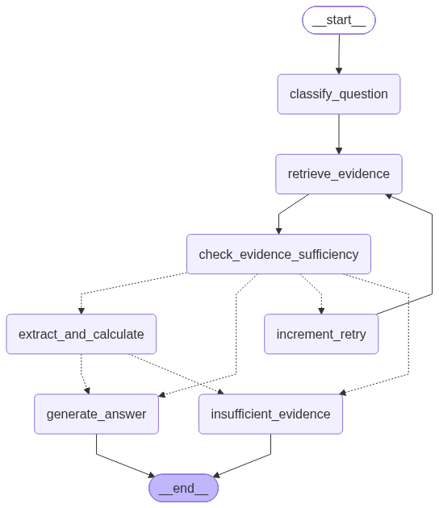

# agent-service

The central reasoning engine for **Project LEDGER**. Powered by **LangGraph** and resource-efficient LLMs, this service is responsible for question classification, multi-step evidence retrieval, evidence sufficiency verification, deterministic arithmetic calculation, and generating verifiable, cited answers adhering to the project's strict answer schema.

Every answer returned by this service is grounded in real retrieved evidence. If the retrieved evidence is insufficient, the service gracefully falls back to `insufficient_evidence` rather than hallucinating financial figures.

---

## Table of Contents

1. [Architecture & LangGraph Workflow](#1-architecture--langgraph-workflow)
2. [Deterministic Tools](#2-deterministic-tools)
3. [Strict Answer Schema Compliance](#3-strict-answer-schema-compliance)
4. [API Endpoints & Contract](#4-api-endpoints--contract)
5. [Running Locally](#5-running-locally)
6. [Validation & Failure Analysis](#6-validation--failure-analysis)
7. [Observability & Tracing (LangSmith)](#7-observability--tracing-langsmith)

---

## 1. Architecture & LangGraph Workflow



The service implements a stateful, cyclic workflow using `langgraph.graph.StateGraph`. Unlike a naive linear chain, it contains **real conditional branches** and an automated retry loop:

```
[START]
   │
   ▼
classify_question
   │
   ▼
retrieve_evidence ◄─────────────────┐
   │                                │
   ▼                                │ (retry if retries < 2)
check_evidence_sufficiency          │
   │                                │
   ├── Sufficient ─────────────┐    │
   │                           │    │
   └── Insufficient ── increment_retry
                               │
                    (retries >= 2)? 
                               │
                    ┌──────────┴──────────┐
                    ▼                     ▼
           insufficient_evidence     [continue to
                    │                 sufficiency check
                    ▼                 branch above]
                 [END]

Sufficient branch:
   │
   ▼
question_type == "numerical"?
   ├── Yes ──► extract_and_calculate
   │              │
   │      (valid formula?)
   │              ├── Yes ──► generate_answer ──► [END]
   │              └── No ───► insufficient_evidence ──► [END]
   │
   └── No ───► generate_answer ──► [END]
```

### State Machine (`AgentState`)

- `question`: Natural language financial query.
- `document_id`: Optional target document identifier (enables corpus-wide search if `None`).
- `question_type`: Categorized as `"numerical"`, `"table"`, or `"text"`.
- `evidence`: Chunks retrieved from `retrieval-api`.
- `is_sufficient`: Boolean flag indicating if evidence contains required facts/operands.
- `retries`: Counter tracking retrieval retry attempts (capped at 2).
- `calculation`: Optional dictionary storing evaluated formula, numeric value, and operand citations.
- `answer`: Final schema-compliant JSON response envelope.

---

## 2. Deterministic Tools

Per project specifications, arithmetic is never performed by the LLM from memory. The service exposes four deterministic tools:

| Tool | Purpose | Implementation Detail |
|---|---|---|
| `search_documents(query, doc_id, limit)` | Hybrid dense + BM25 search across corpus | Calls `POST /search` on `retrieval-api` |
| `search_tables(query, doc_id, limit)` | Filters for tabular chunks specifically | Filters retrieved chunks where `metadata.type == 'table'` |
| `calculate(expression)` | Deterministic mathematical evaluation | Sanitizes input and evaluates safely via `numexpr` |
| `filter_documents(doc_id, section, type)` | Non-search metadata lookup by section/type | Directly filters document chunks without semantic query |

---

## 3. Strict Answer Schema Compliance

The service guarantees 100% compliance with the LEDGER base answer schema:

```json
{
  "answer_type": "<type_name>",
  "evidence": [ { "document_id": "...", "page": 0, "section": "..." } ],
  "params": { ... }
}
```

### Supported Types

- **`direct`**: Single factual lookup directly retrieved from text or table.
  - `params`: `{"value": "<string or number>"}`
  - `evidence`: At least 1 citation with `document_id`, `page`, and `section`.

- **`calculated`**: Values derived via the deterministic `calculate` tool.
  - `params`: `{"value": <number>, "formula": "<string>"}`
  - `evidence`: One citation per operand used in the formula.

- **`multi_span`**: Multiple distinct entities, line items, or values.
  - `params`: `{"values": [...]}`
  - `evidence`: Citations covering all returned values.

- **`insufficient_evidence`**: Graceful fallback when grounding is missing (prevents hallucination).
  - `params`: `{"reason": "<explanation>"}`
  - `evidence`: Empty list `[]`.

---

## 4. API Endpoints & Contract

The service exposes a FastAPI application running on port 8003:

| Endpoint | Method | Purpose |
|---|---|---|
| `/health` | GET | Liveness check |
| `/ask` | POST | Core reasoning entrypoint accepting questions and returning validated answers |

Interactive Swagger documentation is available at `http://localhost:8003/docs`.

### Request Payload (`POST /ask`)

```json
{
  "question": "What was the percentage change in the weighted average number of shares outstanding from 2018 to 2019 in Note 26?",
  "document_id": "torm_sample1"
}
```

*(Note: `document_id` is optional. Omitting it triggers a corpus-wide search across all indexed filings).*

### Response Payload (200 OK)

```json
{
  "answer_type": "calculated",
  "evidence": [
    {
      "document_id": "torm_sample1",
      "page": 1,
      "section": "NOTE 26 — EARNINGS PER SHARE AND DIVIDEND PER SHARE"
    }
  ],
  "params": {
    "value": 1.2311901504787961,
    "formula": "(74.0 - 73.1) / 73.1 * 100"
  }
}
```

---

## 5. Running Locally

### Prerequisites

- Python 3.11 or 3.12
- An active `GROQ_API_KEY` (Free tier provides 14,400 requests/day on `qwen/qwen3.8-27b`)
- `retrieval-api` running on port 8000

### Setup & Launch

```bash
# 1. Activate virtual environment
source venv/Scripts/activate  # On Linux: source venv/bin/activate

# 2. Install dependencies (including local shared schemas)
pip install -r requirements.txt

# 3. Configure environment variables in .env at repository root
# LLM Provider
GROQ_API_KEY=gsk_...

# Service URLs
RETRIEVAL_API_URL=http://localhost:8000

# Observability & Tracing (LangSmith)
LANGSMITH_TRACING=true
LANGSMITH_API_KEY=lsv2_pt_...
LANGSMITH_PROJECT=ledger-agent-service

# 4. Start the service
uvicorn app.main:app --host 0.0.0.0 --port 8003 --reload
```

---

## 6. Validation & Failure Analysis

The service was validated against a multi-tier test suite using real financial filings and tables from the TAT-DQA corpus (e.g., TORM Annual Report sample1.pdf - Note 25 and Note 26):

### 1. General Batch Benchmark

- **Queries tested**: 8 diverse queries covering text lookups, table lookups, arithmetic addition/subtraction, multi-span lists, corpus-wide queries, and unanswerable questions.
- **Result**: 8 / 8 Passed (100%)
- **Average Latency**: ~8.81 seconds per full reasoning cycle.

### 2. Advanced Financial Stress Benchmark

Tested against complex financial edge cases:

- **Negative Number Arithmetic**: Correctly handled profit-versus-loss differences `166.0 - (-34.8) = 200.8`.
- **Compound Percentage Change**: Extracted operands and calculated `(74.0 - 73.1) / 73.1 * 100`.
- **Conditional Multi-Span**: Identified all metrics with negative balances reported in 2018.
- **Financial Metric Discrepancy (Trap)**: Successfully rejected requests for missing metrics (Operating Profit when only Net Profit was present) by returning `insufficient_evidence` instead of guessing.

**Result**: 8 / 8 Passed (100%)

### 3. Documented Failure Modes & Resolutions

**Numerical Sufficiency False-Negatives:**
- *Problem*: A generic prompt asking "Does this answer the question?" caused strict models to return `no` on numerical questions because the calculated total was not explicitly printed in the text.
- *Resolution*: Added an explicit conditional prompt for numerical questions asking if the evidence contains the operands/data needed to calculate the answer.

**Provider Rate Limiting (Google AI Free Tier):**
- *Problem*: Free-tier Gemini models were strictly throttled to 20 requests/day per project, blocking benchmark runs.
- *Resolution*: Integrated `langchain-groq` using `qwen/qwen3.8-27b` (14,400 requests/day and 1,000 RPM), fulfilling the project's resource-efficient model constraint while eliminating rate bottlenecks.

---

## 7. Observability & Tracing (LangSmith)

The service natively integrates with **LangSmith** for full end-to-end tracing, monitoring, and debugging of the LangGraph execution tree. Every request to `POST /ask` is captured and structured hierarchically:

- **Per-Node Granularity:** Real-time visibility into inputs, outputs, prompts, and raw LLM completions for each node (`classify_question`, `retrieve_evidence`, `check_evidence_sufficiency`, `extract_and_calculate`, `generate_answer`).
- **Performance Profiling:** Precise latency breakdown per step, identifying bottleneck stages (e.g., retrieval network roundtrip vs. LLM token generation).
- **Token & Cost Auditing:** Live tracking of prompt tokens, completion tokens, and approximate invocation costs per query.
- **Visual Failure Inspection:** If an unanswerable query triggers the retry loop, LangSmith visually maps the conditional fallback to `insufficient_evidence`.

To view traces, visit [smith.langchain.com](https://smith.langchain.com) under the project `ledger-agent-service`.